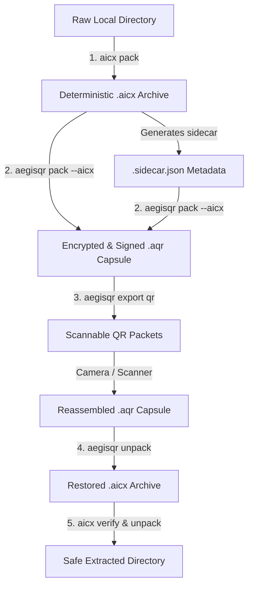

# AICX

AICX, Adaptive Intelligent Compression eXchange, is a Rust-first archive engine for deterministic packing, safe unpacking, and machine-readable metadata. It provides:

- a Rust core in `crates/aicx-core/`
- a CLI in `crates/aicx-cli/`
- Python bindings in `bindings/python/`
- an enterprise integration contract in `plan-enterprise.md`

The top-level `aicx/` package is legacy compatibility code. New work should use the Rust crates or the native Python binding module.

## When to Use AICX

Use AICX when you need to:

- package files into a reproducible archive
- inspect or verify an archive before extraction
- restore files with path validation and no-overwrite defaults
- emit sidecar metadata for downstream tooling or agent pipelines
- call the archive engine from Rust or Python
- feed downstream artifact-repository workflows such as [JFrog Artifactory](https://jfrog.com/artifactory/) and [Sonatype Nexus Repository](https://www.sonatype.com/products/nexus-repository) with deterministic archives and metadata
- hand verified bundles to [AegisQR](https://github.com/apeterson22/AegisQR) for secure transport, approval, and release

Do not use AICX as an encryption layer. AegisQR is a separate repository that can consume AICX archives, manifests, and sidecars.

## Where To Use It

- **CLI automation:** local shells, scripts, and CI jobs that need archive creation or extraction.
- **Rust projects:** application code that wants direct access to the archive engine via `aicx-core`.
- **Python applications:** code under `bindings/python/` that imports `aicx_native`.
- **Legacy compatibility only:** the root `aicx/` Python package, which now prefers `aicx_native` when available.

## Installation

Prerequisites:

- Rust toolchain for the CLI and core crates
- Python 3.10+ for the native bindings
- `maturin` for building the Python extension (`python3 -m pip install maturin`)

### CLI from source

Install the CLI into your local Cargo bin directory:

```sh
cargo install --path crates/aicx-cli
aicx --help
```

You can also run it without installing:

```sh
cargo run -p aicx-cli -- --help
```

### Python bindings for local use

Build and install the native module into your active Python environment:

```sh
cd bindings/python
maturin develop
```

Then import `aicx_native` directly from Python.

### Repository development setup

For contributors working in this repository:

```sh
cargo test --workspace
python3 -m venv .venv
. .venv/bin/activate
pip install -e ".[test]"
cd bindings/python && maturin develop
```

## Quick Start

From the repository root:

```sh
cargo run -p aicx-cli -- pack ./data -o archive.aicx
cargo run -p aicx-cli -- verify archive.aicx
cargo run -p aicx-cli -- digest archive.aicx
cargo run -p aicx-cli -- unpack archive.aicx --out restored
```

From Python after `maturin develop`:

```python
import json
from aicx_native import digest, inspect, pack

manifest = json.loads(pack(["./data"], "archive.aicx", "balanced", 4_194_304, "blake3"))
inspection = json.loads(inspect("archive.aicx"))
hashes = json.loads(digest("archive.aicx"))
```

## How To Use AICX

The usual workflow is:

1. **Pack** files or directories into a deterministic archive.
2. **Inspect / verify** the archive before you trust or distribute it.
3. **Digest / sidecar / report** the archive when downstream automation needs machine-readable metadata.
4. **Unpack or extract** only after validation succeeds.

## CLI Usage

Pack inputs into an archive:

```sh
cargo run -p aicx-cli -- pack ./data ./docs -o archive.aicx --profile balanced --chunk-size 4194304 --hash blake3
```

You can also pack the current directory; AICX canonicalizes the directory root before building the archive:

```sh
cargo run -p aicx-cli -- pack . -o archive.aicx
```

Unpack safely into a target directory:

```sh
cargo run -p aicx-cli -- unpack archive.aicx --out restored
```

Inspect, verify, and review metadata:

```sh
cargo run -p aicx-cli -- inspect archive.aicx
cargo run -p aicx-cli -- verify archive.aicx
cargo run -p aicx-cli -- report archive.aicx
cargo run -p aicx-cli -- sidecar archive.aicx
cargo run -p aicx-cli -- sidecar archive.aicx --format toon
cargo run -p aicx-cli -- digest archive.aicx
cargo run -p aicx-cli -- list archive.aicx
```

Use `extract` to restore a single path and `compare-profiles` to compare archive profiles across inputs:

```sh
cargo run -p aicx-cli -- extract archive.aicx project/config.json --out restored
cargo run -p aicx-cli -- compare-profiles ./data ./docs
```

`inspect` and `report` include deterministic `manifest_digest` and `sidecar_digest` fields for downstream automation, and `digest` prints just those hashes.

## Python Usage

After `maturin develop`, import the native module:

```python
import json
from aicx_native import digest, digest_toon, inspect_toon, pack, sidecar_toon
from aicx_native import manifest_digest, sidecar_digest

manifest = json.loads(pack(["./data"], "archive.aicx", "balanced", 4_194_304, "blake3"))
summary = inspect_toon("archive.aicx")
sidecar = sidecar_toon("archive.aicx")
combined = json.loads(digest("archive.aicx"))
combined_toon = digest_toon("archive.aicx")
manifest_hash = manifest_digest("archive.aicx")
sidecar_hash = sidecar_digest("archive.aicx")
```

The native module is the supported Python interface. The legacy `aicx` package remains for compatibility and forwards the main pack, unpack, extract, inspect, report, sidecar, verify, compare, and digest helpers, including `digest_toon`, to `aicx_native` when installed.

## Common Use Cases

- **Reproducible bundle creation:** package release inputs or project snapshots into a deterministic archive.
- **Pre-extraction safety checks:** verify integrity and review sidecar metadata before restoring files.
- **Agent and automation pipelines:** use `digest`, `inspect`, `report`, or `sidecar` as machine-readable inputs for downstream systems.
- **Selective restore:** extract one path from a verified archive instead of unpacking everything.
- **Repository handoff and transport:** package a codebase or artifact set for later delivery into AegisQR or repository-plugin workflows.

## Integration Examples

### Shell or CI pipeline

Use the CLI as a validation gate in scripts or CI:

```sh
aicx pack ./build-output -o release.aicx --profile secure
aicx verify release.aicx
aicx digest release.aicx > release-digests.json
```

### Python service or automation

Use the bindings when your application needs structured metadata:

```python
import json
from aicx_native import pack, report, unpack

json.loads(pack(["./payload"], "payload.aicx", "balanced", 4_194_304, "blake3"))
archive_report = json.loads(report("payload.aicx"))
json.loads(unpack("payload.aicx", "./restored", None, False, False))
```

### Hash-only integration

Use `digest` or `digest_toon` when another system only needs stable hashes:

```python
import json
from aicx_native import digest

hashes = json.loads(digest("archive.aicx"))
print(hashes["manifest_digest"], hashes["sidecar_digest"])
```

---

## Integration with AegisQR and the AegisQR Suite

AICX and **AegisQR** are designed as sibling, decoupled repositories that communicate strictly via deterministic metadata sidecars and CLI workflows. Together, they form the **AegisQR Suite**—a unified package for zero-trust enterprise secure transport, in-store inventory tracking, and RAG context validation.

### 1. The Sealed Knowledge Capsule Workflow
In this scenario, AICX packages raw data, catalogs, or codebases, and AegisQR encrypts, signs, and physicalizes the capsule.



#### Step-by-Step Workflow Example:
```bash
# Step 1: Package raw store catalog data with AICX
aicx pack ./catalog_directory --profile retail-knowledge-pack --out store_catalog.aicx

# Step 2: Seal inside AegisQR using --aicx for automatic sidecar autodiscovery
# This reads 'store_catalog.sidecar.json' and embeds risk levels into the AQR1 header
aegisqr pack store_catalog.aicx --out store_catalog.aqr --aicx --passphrase-stdin <<< "my-secret-passphrase"

# Step 3: Inspect the public capsule header without the passphrase
aegisqr inspect store_catalog.aqr

# Step 4: Split into visual QR packets for physical camera transit
aegisqr export qr store_catalog.aqr --out qr_sheets

# Step 5: Import and verify cryptographic signature
aegisqr import qr qr_sheets --out imported_catalog.aqr
aegisqr verify imported_catalog.aqr

# Step 6: Decrypt the .aicx archive
aegisqr unpack imported_catalog.aqr --out restored_archive/

# Step 7: Unpack securely with path-traversal safeguards
aicx unpack restored_archive/store_catalog.aicx --out ./final_catalog/
```

### 2. Coordinated Enterprise Licensing
Both applications share the exact same cryptographic, offline-first licensing core, validating organization tiers and seat counts natively without calling home:
* **Shared Config Paths:** Installing a `.aqlic` file with `aegisqr license install` automatically updates `/etc/aegisqr/license.aqlic` or `~/.config/aegisqr/license.aqlic`, immediately activating license permissions for `aicx` as well.
* **Shared Key Rotation:** Trust directories in `/etc/aegisqr/trusted_keys.d/` dynamically rotate Ed25519 signing keys for both tools concurrently.

### 3. AegisQR Suite Package Installer
The root `aegisqr-suite` repository acts as the packaging and distribution layer. It compiles both codebases in release mode and bundles them into a single unified distribution package with `install.sh` and `uninstall.sh` scripts, making it trivial for enterprise operations teams to manage, version-control, and roll out updates across store networks.

---


## Repository Layout

- `crates/aicx-core/`: archive model, validation, hashing, safe paths, and pack/unpack logic.
- `crates/aicx-cli/`: command-line entry points.
- `bindings/python/`: PyO3/maturin bindings for Python callers.
- `aicx/`: legacy Python compatibility layer for `aicx_native`.
- `plan-enterprise.md`: integration contract for repository plugins and AegisQR.
- `.github/workflows/ci.yml`: CI that runs `cargo test --workspace` and builds the Python bindings with `maturin build --release`.
- `.github/workflows/codeql.yml`: CodeQL scanning for Rust and Python code.
- Any future UI should be a thin Rust frontend over `aicx-core`; do not duplicate archive validation or extraction logic.
- An enterprise UI should stay thin and call the plugin/API contract in `plan-enterprise.md`.

## Safety Notes

- Treat all archive inputs as untrusted and potentially hostile.
- Keep extraction inside designated, sandboxed directories.
- Do not disable cryptographic hash or path-traversal validation for convenience.
- Expired licenses trigger warning indicators but **never block core packaging or extraction utility** (protecting your archives from being locked out).

---

## Enterprise Licensing & Administration

AICX features an offline-first cryptographic licensing layer, sharing configuration and trust directories seamlessly with AegisQR:
* Global config path: `/etc/aegisqr/license.aqlic`
* Portable user configuration: `~/.config/aegisqr/license.aqlic`
* Dynamic verification keys directory: `/etc/aegisqr/trusted_keys.d/`

### Licensing CLI Reference

##### 1. Check License Status
```bash
aicx license status
```
*Tip:* Use the mandated `--json` flag to inspect programmatically:
```bash
aicx license status --json
```

##### 2. Install a Shared `.aqlic` File
```bash
aicx license install ./my_license.aqlic
```

##### 3. View Full License Structure
```bash
aicx license show --json
```

---

## Standardized JSON Output for Programmatic Integration

To support robust parent child-processes (such as Python `subprocess` or Node `child_process` wrappers), key query commands—including `inspect`, `verify`, `digest`, and `license status`—natively output standardized, version-locked JSON. This prevents programmatic parser failures in downstream software workflows.

---

## 📦 Mission: Deterministic Information Sharing in the AI Age

In the era of large language models, retrieval-augmented generation (RAG), and autonomous AI agent execution, data flows with unprecedented speed and complexity. AI models dynamically ingest massive directories, code repositories, and planograms to make real-time decisions.

Without a rigid verification framework, this fluid data sharing introduces critical risks:
* **Hallucinatory Context Ingestion:** If files in a RAG pipeline are unverified or subtly modified, models generate incorrect decisions based on altered inputs.
* **Malicious Executable Traversal:** Hostile archives can exploit folder traversals to overwrite critical system components.
* **Lack of Metadata Traceability:** Agents cannot quickly index large datasets without expensive, slow scanning steps.

### The AICX Solution: Deterministic context validation

AICX solves this by creating **tamper-proof, deterministic knowledge capsules** tailored for both human developers and autonomous AI:
* **Blake3 Manifest Verification:** All contents are compiled with strict deterministic Blake3 hash catalogs, guaranteeing bit-for-bit authenticity.
* **ScoutAI Sidecar Discovery:** Companion sidecars dynamically expose schema versioning, query hints, risk level classifications, and entrypoint candidates, allowing agents to assess capsules instantly *before* unpacking.
* **Hardened Traversal Safeguards:** Path-traversal exploits (such as `..` injections) and symlinks are strictly blocked at the core library level, preventing directory escapes.

Through rigid mathematical verification and structured machine-readable metadata sidecars, AICX enables organizations and AI agents to share local catalogs, configurations, and RAG contexts with total, auditable certainty in the AI age.
